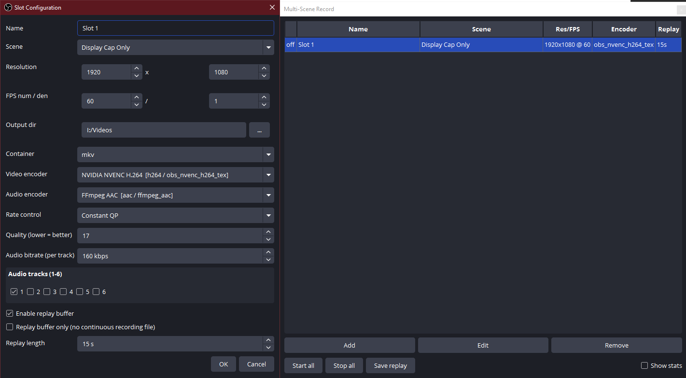

# multi-scene-record

An OBS Studio plugin that lets you record and clip from multiple scenes simultaneously — independent outputs, independent replay buffers, all running in the background while you stream from just one scene.

---

## Why this exists

You ever been in that situation where you go "man, I wish I could record while streaming without having my overlays on the recording"? Well, source-record already handles that basically, and is a great plugin for it. Then someone with a very specific request appeared on Reddit and no matter what existing plugin combos I'd use, I couldn't achieve the desired result. So here we are; now you can record and clip separately any scene you want with any overlays/cameras/anything you have in there.  
´´´ - "Slots" in this plugin are completely separate from you main stream/recording. 
Shared encoder option does exist in this plugin, but you can only select the encoder of another existing "slot". So if you want to re-use existing encoder it's best to use only the plugin for recording to reduce encoder overhead. Using main obs recording output with this plugin will always result in one unnecessary encoder instance since that main output is fully separated from the plugin and can't be shared.´´´

---

## Heads up

This plugin was built with the help of Claude AI (Opus 4.7 and 4.6 for code, Sonnet 4.6 for prompting and auditing). I know some of you hate AI-assisted code more than anything — fair enough, figured I'd be upfront about it rather than pretend otherwise.  

That said, the plugin has been code-audited, the OBS API usage has been verified against OBS 30.x internals, and it works. I am fairly certain that the code is not perfect. But it works now and this was as far as I could bring it and clean it with my knowhow and non existent expertise. In this stage, finding someone with actual knowledge to help maintain, audit/clean the project would be nice.

**If you have actual OBS plugin development experience and want to take over maintaining this properly, I'm genuinely happy to hand it over.** If a future OBS update breaks something and I'm not around to fix it, I'd rather it be in capable hands than go abandoned.

---

## Features

- Independent per-slot recording output — each slot gets its own video pipeline, fully isolated from the stream and from each other
- Independent per-slot replay buffer — save clips from any slot via hotkey or button, not just the active scene
- Replay-buffer-only mode — run a slot with no continuous recording file, clips on demand only
- Background scene rendering — inactive scenes stay rendered and captured without being the active OBS scene
- Per-slot resolution and FPS — each slot can output at a different resolution and frame rate
- Per-slot video encoder selection — picks up all encoders available on your machine (NVENC, AMF, QSV, x264, etc.)
 - You can also use existing slots encoder to reduce encoder overhead.
- Per-slot rate control — introspects the selected encoder's actual supported modes (CBR, CQP, CRF, VBR, etc.), not a hardcoded list
- Per-slot audio encoder selection — choose per slot (AAC, Opus, etc.)
- Per-slot audio track selection — select any combination of OBS's 6 audio mixer tracks per slot
- Per-slot audio bitrate
- Per-slot output directory
- Per-slot container format (MKV, MP4, MOV, FLV, TS)
- Per-slot replay buffer duration
- Per-slot hotkeys — toggle recording and save replay independently for each slot
- Stats display — frames, dropped frames, live bitrate per slot, toggleable (polling stops when disabled)
- Full persistence — slot configs saved and restored per scene collection
- Dockable UI panel

---

## Installation

### Option 1 — Download (recommended)

Grab the latest release from the [Releases](../../releases) page. Extract the zip and drop the contents into your OBS plugins folder:

- **Windows:** `C:\Program Files\obs-studio\obs-plugins\64bit\`

Restart OBS. The plugin shows up as a dockable panel under **Docks**.

> **Platform note:** This plugin has only been tested on Windows. Linux and macOS are untested — it may or may not work, and there's no guarantee of support for those platforms at this time.

### Option 2 — Build from source

See [BUILD.md](BUILD.md) for full instructions.

---

## Usage

1. Open the dock via **Docks → Multi Scene Record**
2. Click **Add** to create a slot — pick your scene, resolution, encoder, output path, etc.
3. Enable replay buffer per slot if you want clipping without a continuous file
4. Assign hotkeys in OBS Settings → Hotkeys — each slot gets its own toggle and save-replay hotkey
5. Hit **Start all** or start slots individually
6. Save clips via hotkey or the **Save replay** button in the dock

---

## Notes

- Slots share OBS's global audio mix — audio routing is configured via OBS's Advanced Audio Properties as usual
- MP4 replay buffers are not recoverable if OBS crashes before the clip is saved. MKV doesn't have this problem — prefer MKV if you're using replay-buffer-only mode
- Each active slot costs additional encode overhead — plan your encoder choices accordingly. This is also why shared encoder exists.
- example with 3 slots:  
 - Without shared encoder: 3 encode passes per frame
 - With shared encoder (slots 2+3 depend on slot 1): 1 encode pass per frame, 3 file writers
